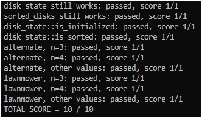

# Alternating Disks Sorting Algorithms - C++ Implementation

This C++ library provides two efficient algorithms to solve the "alternating disks" problem:

- Alternate Sorting: A straightforward approach with alternating comparisons.
- Lawnmower Sorting: A more optimized method that resembles the movement of a lawnmower.

## Problem Description

The "alternating disks" problem involves sorting a sequence of disks with two alternating colors (dark and light) into a state where all dark disks are grouped on the left and all light disks are on the right.

## Key Features

- disk_state Class: Represents the arrangement of disks, providing methods to:
- Create an initial alternating state.
- Check if the state is initialized/sorted.
- Access, swap, and manipulate individual disks.
- Convert the state into a string representation.
- sorted_disks Class: Encapsulates the result of a sorting operation, including:
- The final sorted disk_state.
- The number of swaps performed during sorting.
- sort_alternate Function: Implements the alternate sorting algorithm.
- sort_lawnmower Function: Implements the lawnmower sorting algorithm.

## Algorithm Explanations

- Alternate Sorting: This algorithm iterates through the disk sequence, comparing and swapping adjacent disks if they are out of order. The comparison pattern alternates between light-dark and dark-light pairs in each pass.
- Lawnmower Sorting: This algorithm is more efficient. It makes multiple passes through the sequence, similar to a lawnmower pattern. In each pass, it moves one dark disk as far to the left as possible, and then one light disk as far to the right as possible.

## Results

## Contributor

- Erik Williams 🤔
